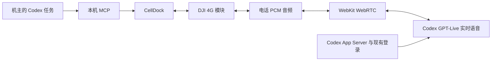

# CellDock × Codex 原生语音

基于 [CellDock](https://github.com/celldock/celldock-for-mac) 的个人非商业改造。CellDock 管理 DJI 4G 模块、SIM、短信、电话和蜂窝网络；Codex 使用现有 ChatGPT 登录处理指令及原生实时语音。

## 使用

1. 打开 CellDock，确保模块已联网、能够正常打电话。
2. 在设置中的「Codex 电话助理」点击「测试 Codex 原生语音」。无需开启系统听写、安装识别模型或填写 API Key。
3. 开启「Codex 自动接听来电」后，来电接通即由 AI 助理交谈。默认开场说明 AI 身份，单次通话最长 10 分钟。
4.「自动保存 AI 通话录音」默认开启。AI 开场会告知录音；挂断后从左侧录音库或设置中的「查看通话记录与录音」回放、导出。文字逐句保存，重启后仍可查询。
5. 在 Codex 中指示查找联系人、拨打指定号码、发送指定短信或通过模块上网。

短信目前按机主指令读取和发送。自动接听默认关闭，开启后处理所有来电；最长通话可配置为 60–3600 秒。语音开始连接需要时间，服务错误会结束 AI 电话并记录错误，避免长时间静默占线。

## 实现



使用本机 Codex 的 `thread/realtime/start`、`transport=webrtc`、`version=v3`。Codex 自己处理登录、创建语音会话和模型交接；CellDock 不读取、复制或保存 ChatGPT 令牌。WebKit 从电话 PCM 创建音轨，将返回的模型音频转换成 8 kHz 单声道 PCM，交回原来的 USB 音频服务。不会采集 Mac 麦克风或把模型声音播放到 Mac 扬声器。

语音理解、发声、轮次判断与打断由 Codex 原生实时模型处理，没有 Apple Speech、Whisper 或外接语音合成链路。[官方原生语音说明](https://learn.chatgpt.com/docs/features/voice)、[App Server](https://learn.chatgpt.com/docs/app-server)、[官方实时连接实现](https://github.com/openai/codex/blob/main/codex-rs/core/src/realtime_conversation.rs)。这些实时协议仍属实验接口，升级 Codex 后应重新运行语音测试。

通话音频会发送给 Codex 语音服务，受账户额度和网络状态影响。电话会话设为 ephemeral，禁用 shell、Web 搜索、apps、MCP 和环境访问；电话另一端不能通过说话取得机主电脑的操作权。机主自己的 Codex 任务通过独立的电话 MCP 执行已授权操作。

## 电话工具

| 需求 | 工具 |
| --- | --- |
| 查找联系人 | `phone_find_contact` |
| 拨号、接听、挂断、按键 | `phone_dial`、`phone_answer`、`phone_hangup`、`phone_dtmf` |
| 收发短信 | `phone_sms_list`、`phone_sms_send` |
| 查看近期来电、短信事件 | `phone_events` |
| 查找历史 AI 电话、文字和原声录音路径 | `phone_calls_list`、`phone_call_get` |
| 蜂窝关闭、保持连接或优先上网 | `phone_network_set` |
| 单次用模块获取网页 | `phone_cellular_fetch` |
| 自动接听、角色、开场白 | `phone_agent_configure` |
| 原生语音自检 | `phone_voice_test` |

注册 MCP（Python 3 仅用于工具适配，不运行语音模型）：

```sh
codex mcp add celldock-phone -- python3 /ABSOLUTE/PATH/scripts/codex_phone.py --mcp
```

CLI 也可直接使用：

```sh
python3 scripts/codex_phone.py status
python3 scripts/codex_phone.py agent.voiceTest
python3 scripts/codex_phone.py agent.configure '{"autoAnswer":true}'
python3 scripts/codex_phone.py network.fetch '{"url":"https://example.com"}'
```

`accepted` 代表请求已交给应用，拨号和网络切换须再查 `status`。短信 `deliveryUncertain` 不可盲目重发。为操作指定固定 `--request-id`，结果不确定时复用原 ID。

## 构建和安装

通常使用 SwiftPM 及原打包脚本。Command Line Tools 的 SwiftPM 不完整时，可从已安装的 CellDock 复用资源和辅助服务：

```sh
python3 scripts/build_codex_local.py \
  --base-app /Applications/CellDock.app \
  --identity YOUR_CERTIFICATE_SHA1
```

脚本从本仓库编译主应用、USB、eUICC 桥接，以本机 Keychain 中的证书签名，输出当前 CPU 架构的 `outputs/CellDock.app`。仓库不保存私钥。自签证书需加载 Sparkle 时可明确选择 `--library-validation-exception`，只放宽 CellDock 的动态库验证，不修改系统信任或 Gatekeeper。可选 `--swift-overlay PATH` 用于已有的 CLT 模块映射兼容文件。

保留旧应用备份，再退出并替换 `/Applications/CellDock.app`。此版本关闭上游自动更新，防止定制功能被覆盖。

## VoWiFi 网络服务

本地构建必须以 `app.celldock.mac` 签名主应用，并以固定 helper/runtime 标识签名辅助服务；三者必须使用同一证书。不能沿用 Swift 编译产物的 `CellDock` 临时签名标识，否则 helper 拒绝应用身份，VoWiFi 查询也会失败。打包现在验证三者的标识与证书。出现此类错误时界面显示「网络服务不可用」；LTE 电话和软件 VoWiFi 是独立链路。VoWiFi 显示「已关闭」只证明能查询网络服务，不代表运营商 SIM 鉴权、ePDG 隧道、IMS 注册已通过。

## 数据与验证

本机桥接只监听 `127.0.0.1:8767`，要求随机 Bearer 凭证，拒绝浏览器 Origin、重复头、含糊长度和超大请求。客户端禁用本机代理。凭证位于 `~/Library/Application Support/CellDock/CodexBridge/token`，权限 0600，目录权限 0700。

最近 200 个操作去重记录保存参数哈希和结果；最近 300 条事件保留在内存；AI 通话文字另按通话 ID 逐句原子写入 `CodexBridge/Calls/<UUID>.json`，目录 0700、文件 0600。意外中断的文字记录在重启时标注为中断。双向原声由原有 USB 音频链路写入 `Recordings/*.m4a`：左声道是对方，右声道是实际送往模块的 AI 音频，保留停顿。音频在挂断后编码保存；应用崩溃或强制退出前尚未完成的录音不保证可恢复。文字可能有转写错误，也可能包含被打断的 AI 回答，应以原声为准。关闭 AI 自动录音从下一通生效，原有手动录音和全局自动录音设置独立。原应用的短信、联系人和电话记录沿用原存储。不要上传运行目录、SIM 标识、号码、短信、联系人、令牌或签名私钥。

`agent.voiceTest` 通过实际发布的 WebRTC 音频代码验证连接与可听回复，不拨号、不录麦克风。可传入 `pcm8k`（8 kHz PCM16 单声道的 Base64，最长 10 秒）检验识别往返。

主机音频自检不能代替实机电话验收。自动接听、电话双向 AI 对话、打断、挂断恢复应分别记录实际测试结果；未测试的能力不能标记为已验收。

## 许可证

继承 [CellDock 非商业许可](../LICENSE)，保留原作者版权；第三方组件遵循 [各自许可证](THIRD_PARTY_NOTICES.md)。商业用途需要原作者书面许可。
